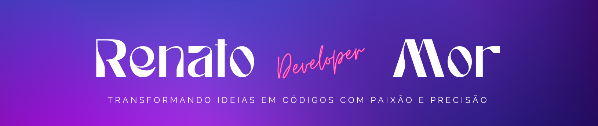

 
  

<h1 align="center">Formação GitHub Certification</h1>

<h2 align="center">Projeto AZ-900 Certification: Explorando os Benefícios da Azure</h2>

 
  

<h5> I ❤️ Back-End Development!</h5>

<h3 >Encontre-me :handshake: </h3>

    
    
    
</a>
    
    
    

 

## Menu

- [Introdução](#introdução)
- [Objetivos de aprendizado](#objetivos-de-aprendizado)
- [Benefícios da alta disponibilidade e escalabilidade na nuvem](#benefícios-da-alta-disponibilidade-e-escalabilidade-na-nuvem)
- [Benefícios da fiabilidade e previsibilidade na nuvem](#benefícios-da-fiabilidade-e-previsibilidade-na-nuvem)
- [Benefícios da segurança e governança na nuvem](#fundamentos-do-azure)
- [benefícios da capacidade de gerenciamento na nuvem](#benefícios-da-capacidade-de-gerenciamento-na-nuvem)
- [Licença](#licença-traffic_light)
- [Agradecimentos](#agradecimentos-tada)

## Introdução

Neste módulo, você será apresentado a alguns dos benefícios que a computação em nuvem oferece. Você aprenderá como a computação em nuvem pode ajudá-lo a atender à demanda variável e, ao mesmo tempo, fornecer uma boa experiência para seu cliente. Você também aprenderá sobre segurança, governança e capacidade geral de gerenciamento na nuvem.

Este módulo apresenta a computação em nuvem. Abrange coisas como conceitos de nuvem, modelos de implantação e compreensão da responsabilidade compartilhada na nuvem.

### Objetivos de aprendizado

Após a conclusão deste módulo, adquiri conhecimentos e habilidade para ser capaz de:

- Definir computação em nuvem.

- Descreva o modelo de responsabilidade compartilhada.

- Definir modelos de nuvem, incluindo pública, privada e híbrida.

- Identificar casos de uso apropriados para cada modelo de nuvem.

- Descrever o modelo baseado em consumo.

Comparar modelos de preços de nuvem.

## Benefícios da alta disponibilidade e escalabilidade na nuvem

Ao criar ou implantar um aplicativo em nuvem, duas das maiores considerações são o tempo de atividade (ou disponibilidade) e a capacidade de lidar com a demanda (ou escala).

### Elevada disponibilidade

Quando você está implantando um aplicativo, um serviço ou quaisquer recursos de TI, é importante que os recursos estejam disponíveis quando necessário. A alta disponibilidade se concentra em garantir a máxima disponibilidade, independentemente de interrupções ou eventos que possam ocorrer.

Ao arquitetar sua solução, você precisará levar em conta as garantias de disponibilidade do serviço. O Azure é um ambiente de nuvem altamente disponível com garantias de tempo de atividade dependendo do serviço. Essas garantias fazem parte dos acordos de nível de serviço (SLAs).

### Escalabilidade

Outro grande benefício da computação em nuvem é a escalabilidade dos recursos de nuvem. Escalabilidade refere-se à capacidade de ajustar recursos para atender à demanda. Se, de repente, você tiver picos de tráfego e seus sistemas ficarem sobrecarregados, a capacidade de dimensionar significa que você pode adicionar mais recursos para lidar melhor com o aumento da demanda.

O outro benefício da escalabilidade é que você não está pagando demais pelos serviços. Como a nuvem é um modelo baseado no consumo, você paga apenas pelo que usa. Se a demanda cair, você pode reduzir seus recursos e, assim, reduzir seus custos.

O dimensionamento geralmente vem em duas variedades: vertical e horizontal. O dimensionamento vertical está focado em aumentar ou diminuir as capacidades dos recursos. O dimensionamento horizontal é adicionar ou subtrair o número de recursos.

### Dimensionamento vertical

Com o dimensionamento vertical, se você estivesse desenvolvendo um aplicativo e precisasse de mais poder de processamento, poderia escalar verticalmente para adicionar mais CPUs ou RAM à máquina virtual. Por outro lado, se você percebesse que tinha especificado demais as necessidades, poderia reduzir verticalmente reduzindo as especificações de CPU ou RAM.

### Dimensionamento horizontal

Com o dimensionamento horizontal, se você de repente tiver um salto acentuado na demanda, seus recursos implantados poderão ser dimensionados (automática ou manualmente). Por exemplo, você pode adicionar máquinas virtuais ou contêineres adicionais, dimensionando-os. Da mesma forma, se houvesse uma queda significativa na demanda, os recursos implantados poderiam ser dimensionados (automaticamente ou manualmente), escalando.

## Benefícios da fiabilidade e previsibilidade na nuvem

Confiabilidade e previsibilidade são dois benefícios cruciais da nuvem que ajudam você a desenvolver soluções com confiança.

### Fiabilidade

Confiabilidade é a capacidade de um sistema de se recuperar de falhas e continuar a funcionar. É também um dos pilares do Microsoft Azure Well-Architected Framework.

A nuvem, em virtude de seu design descentralizado, suporta naturalmente uma infraestrutura confiável e resiliente. Com um design descentralizado, a nuvem permite que você tenha recursos implantados em regiões ao redor do mundo. Com esta escala global, mesmo que uma região tenha um evento catastrófico, outras regiões ainda estão em funcionamento. Você pode projetar seus aplicativos para aproveitar automaticamente essa maior confiabilidade. Em alguns casos, o próprio ambiente de nuvem mudará automaticamente para uma região diferente para você, sem necessidade de nenhuma ação de sua parte. Você aprenderá mais sobre como o Azure aproveita a escala global para fornecer confiabilidade mais adiante nesta série.

### Previsibilidade

A previsibilidade na nuvem permite-lhe avançar com confiança. A previsibilidade pode centrar-se na previsibilidade do desempenho ou na previsibilidade dos custos. O desempenho e a previsibilidade de custos são fortemente influenciados pelo Microsoft Azure Well-Architected Framework. Implante uma solução construída em torno dessa estrutura e você terá uma solução cujo custo e desempenho são previsíveis.

### Desempenho

A previsibilidade de desempenho se concentra em prever os recursos necessários para oferecer uma experiência positiva para seus clientes. Dimensionamento automático, balanceamento de carga e alta disponibilidade são apenas alguns dos conceitos de nuvem que oferecem suporte à previsibilidade de desempenho. Se, de repente, você precisar de mais recursos, o dimensionamento automático pode implantar recursos adicionais para atender à demanda e, em seguida, reduzir quando a demanda cair. Ou se o tráfego estiver fortemente concentrado em uma área, o balanceamento de carga ajudará a redirecionar parte da sobrecarga para áreas menos estressadas.

### Custo

A previsibilidade de custos está focada em prever ou prever o custo dos gastos na nuvem. Com a nuvem, você pode acompanhar o uso de recursos em tempo real, monitorar recursos para garantir que os está usando da maneira mais eficiente e aplicar análises de dados para encontrar padrões e tendências que ajudam a planejar melhor as implantações de recursos. Ao operar na nuvem e usar informações e análises na nuvem, você pode prever custos futuros e ajustar seus recursos conforme necessário. Pode até utilizar ferramentas como o Custo Total de Propriedade (TCO) ou a Calculadora de Preços para obter uma estimativa dos potenciais gastos na nuvem.

## Benefícios da segurança e governança na nuvem

Não importa se você está implantando infraestrutura como serviço ou software como serviço, os recursos de nuvem oferecem suporte a governança e conformidade. Coisas como definir modelos ajudam a garantir que todos os recursos implantados atendam aos padrões corporativos e aos requisitos regulatórios governamentais. Além disso, você pode atualizar todos os seus recursos implantados para novos padrões à medida que os padrões mudam. A auditoria baseada na nuvem ajuda a sinalizar qualquer recurso que esteja fora de conformidade com os padrões corporativos e fornece estratégias de mitigação. Dependendo do seu modelo operacional, patches e atualizações de software também podem ser aplicados automaticamente, o que ajuda na governança e na segurança.

Do lado da segurança, pode encontrar uma solução na nuvem que corresponda às suas necessidades de segurança. Se você quiser o máximo controle de segurança, a infraestrutura como serviço fornece recursos físicos, mas permite gerenciar os sistemas operacionais e o software instalado, incluindo patches e manutenção. Se você quer que os patches e a manutenção sejam tratados automaticamente, as implantações de plataforma como serviço ou software como serviço podem ser as melhores estratégias de nuvem para você.

E como a nuvem se destina a fornecer recursos de TI pela Internet, os provedores de nuvem geralmente são adequados para lidar com coisas como ataques distribuídos de negação de serviço (DDoS), tornando sua rede mais robusta e segura.

Ao estabelecer uma boa pegada de governança antecipadamente, você pode manter sua pegada de nuvem atualizada, segura e bem gerenciada.

## Benefícios da capacidade de gerenciamento na nuvem

Um dos principais benefícios da computação em nuvem são as opções de capacidade de gerenciamento. Há dois tipos de capacidade de gerenciamento para computação em nuvem que você aprenderá nesta série, e ambos são excelentes benefícios.

### Gestão da nuvem

O gerenciamento da nuvem fala com o gerenciamento de seus recursos de nuvem. Na nuvem, você pode:

- Dimensione automaticamente a implantação de recursos com base na necessidade.
- Implante recursos com base em um modelo pré-configurado, eliminando a necessidade de configuração manual.
- Monitore a integridade dos recursos e substitua automaticamente os recursos com falha.
- Receba alertas automáticos com base em métricas configuradas, para que você esteja ciente do desempenho em tempo real.

### Gestão na nuvem

O gerenciamento na nuvem fala sobre como você pode gerenciar seu ambiente e recursos na nuvem. Você pode gerenciá-los:

- Através de um portal web.
- Usando uma interface de linha de comando.
- Usando APIs.
- Com o PowerShell.

## Licença

Este projeto está licenciado sob a Licença consulte o arquivo
[MIT](https://opensource.org/licenses/MIT).

## Agradecimentos

_**Digital Innovation One**_

Agradeço à Digital Innovation One por proporcionar recursos educacionais valiosos que contribuíram para o desenvolvimento dos meus projetos.

_**Azure**_

Expresso minha gratidão à equipe do Microsoft Azure por oferecer uma plataforma robusta e escalável para hospedar e gerenciar aplicativos em nuvem. A eficiência e confiabilidade do Azure são fundamentais para o sucesso de muitos projetos.

_**VS Code**_

Agradeço à equipe do Visual Studio Code pelo incrível editor que facilita o desenvolvimento deste projeto.

_**Microsoft**_

Agradeço à equipe da Microsoft por suas contribuições inovadoras para o mundo da tecnologia. Sua dedicação ao desenvolvimento de software e serviços tem impactado positivamente a comunidade global de desenvolvedores.

_**GitHub**_

Agradeço à equipe do GitHub por fornecer uma plataforma de desenvolvimento colaborativo que facilita o compartilhamento de projetos.

Copyright © 2024 / RenatoMor
